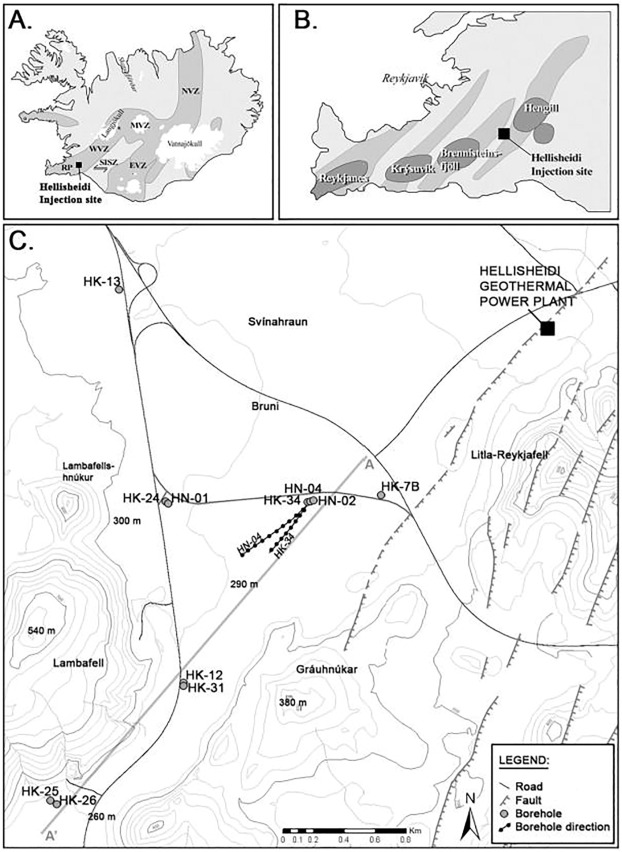
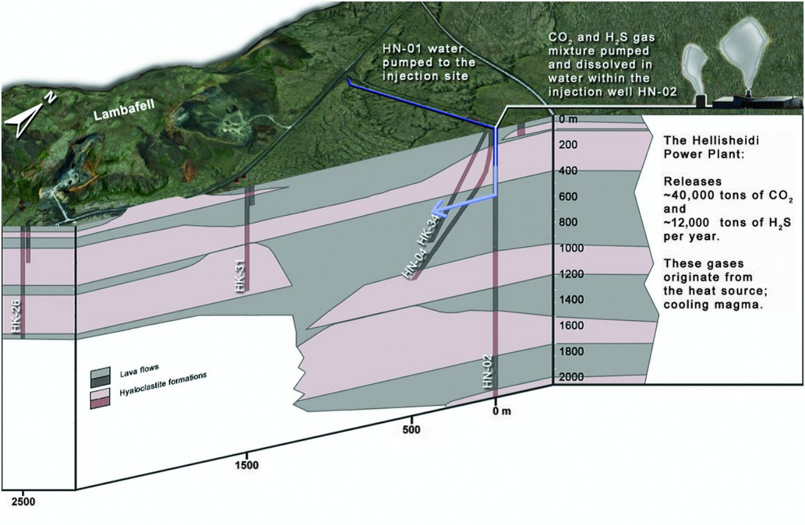

```{r setup, include=FALSE}
library(tufte)
library(ggplot2)
library(readxl)
library(plotly)
#library(reshape2)
library(gtools)
library(MASS)
library(ggridges)
library(pracma)
library(viridis)
library(colorspace)
library(dplyr)
library(tidyr)
#library(sf)
#library(tidyphreeqc)

#library(formatR)
# invalidate cache when the tufte version changes
knitr::opts_chunk$set(tidy = FALSE, echo = FALSE, cache=FALSE)
options(htmltools.dir.version = FALSE)

```

```{r Define theme white, include=FALSE, echo=FALSE}
# Define white theme (handouts) ------------------------------------------------------
theme_white = function(base_size = 8, base_family = "") {
  
  theme_grey(base_size = base_size, base_family = base_family) %+replace%
    
    theme(
      # Specify axis options
      axis.line = element_blank(),  
      axis.text.x = element_text(size = base_size*0.8, color = "black", lineheight = 0.9, face = "bold"),  
      axis.text.y = element_text(size = base_size*0.8, color = "black", lineheight = 0.9, face = "bold"),  
      axis.ticks = element_line(color = "black", size  =  0.2),  
      axis.title.x = element_text(size = base_size, color = "black", margin = margin(0, 10, 0, 0), face = "bold"),  
      axis.title.y = element_text(size = base_size, color = "black", angle = 90, margin = margin(0, 10, 0, 0), face = "bold"),  
      axis.ticks.length = unit(0.3, "lines"),   
      # Specify legend options
      legend.background = element_rect(color = NA, fill = "white"),  
      legend.key = element_rect(color = "black",  fill = "white"),  
      legend.key.size = unit(1.2, "lines"),  
      legend.key.height = NULL,  
      legend.key.width = NULL,      
      legend.text = element_text(size = base_size*0.8, color = "black"),  
      legend.title = element_text(size = base_size*0.8, face = "bold", hjust = 0, color = "black"),  
      legend.position = "right",  
      legend.text.align = NULL,  
      legend.title.align = NULL,  
      legend.direction = "vertical",  
      legend.box = NULL, 
      # Specify panel options
      panel.background = element_rect(fill = "white", color  =  NA),  
      panel.border = element_rect(fill = NA, color = "black"),  
      panel.grid.major = element_line(color = "grey35", size=0.05),  
      panel.grid.minor = element_line(color = "grey20", size=0.05),  
      panel.margin = unit(0.5, "lines"),   
      # Specify facetting options
      strip.background = element_rect(fill = "grey30", color = "grey10"),  
      strip.text.x = element_text(size = base_size*0.8, color = "black"),  
      strip.text.y = element_text(size = base_size*0.8, color = "black",angle = -90),  
      # Specify plot options
      plot.background = element_rect(color = "white", fill = "white"),  
      plot.title = element_text(size = base_size*1.2, color = "black"),  
      plot.margin = unit(rep(1, 4), "lines")
      
    )
  
}
```


\newcommand{\mathalert}[1]{\textcolor{red}{\mathbf{#1}}}

```{=tex}
\newcommand{\highlight}[2][yellow]{\mathchoice%
  {\colorbox{#1}{$\displaystyle#2$}}%
  {\colorbox{#1}{$\textstyle#2$}}%
  {\colorbox{#1}{$\scriptstyle#2$}}%
  {\colorbox{#1}{$\scriptscriptstyle#2$}}}
```


```{=tex}
\newcommand{\carb}{CO$_2$}
\newcommand{\dC}{$\delta$$^{13}$C}
\newcommand{\micmoll}{$\mu$mol/l}
\newcommand{\bicarb}{$HCO_{3}^-$}
\newcommand{\sulfate}{SO$_4^{2-}$}
```
```{=tex}
\colorlet{very-short-term}{LightPink1}
\colorlet{short-term}{LightBlue1}
\colorlet{long-term}{LightGoldenrod1}
```
\marginnote{This is an R markdown document.  It is similar to a jupyter notebook that you might be more familiar with.  You can both explore the code, and also compile the final document to pdf output.  This should provide you with some familiarisation of "R", as well as the science.}


This practical will take place on your laptops via a web-browser (hopefully).  Navigate to moodle in a web browser and click on the link to the CarFix practical.  This will open a Binder webpage which will compile into an interface that is identical to the RStudio App.  Some of you will be familiar with this app, but if you have never used if before you will. need to spend a few minutes familiarising yourself with it and making sure you know how to run R.

\noindent The CarbFix\marginnote{Those of you who took petrology at PII may well have heard about CarbFix already.} project in Iceland was created to develop the technology to store carbon dioxide as stable carbonate minerals directly in the subsurface by reacting gas charged injection waters with basaltic rocks.  Carbon storage in basaltic rocks offers numerous advantages including their ability to promote mineral carbonation and their large potential storage volume.  Numerous studies have focused on developing the technology to safely store \carb\ in basaltic rocks including laboratory experiments, modelling and field studies.   Basaltic rocks are rich in divalent cations such as \ce{Ca^{2+}}, \ce{Mg^{2+}}, and \ce{Fe^{2+}}. The injection of acidic water enriched in \ce{CO2} promotes the release of these cations\marginnote{\ce{Fe^{2+}} is not a typical cation in natural waters.  Think about why it is a cation in these particular waters}, potentially leading to the formation of carbonate minerals such as calcite, magnesite, and siderite as the continued dissolution of basalt increases the pH of the aqueous fluid.  About 5% of the continents and most of the oceanic floor are comprised of basaltic rocks, including the mid-oceanic ridges. As such the largest basaltic storage potential lies offshore; theoretically all \ce{CO2} from the burning of fossil fuel carbon (estimated to be ca. 5000Gt)\marginnote{Do you remember how much carbon is in the ocean-atmosphere system?}. The flanks of mid-ocean ridges contain highly fractured and permeable basaltic layers with a pervasive hydrothermal circulation of about 1000Gt seawater/yr. Lab results have demonstrated that basaltic rocks dissolve rapidly in seawater which is rich in \carb. 
\marginnote{Note that there has already been a sequel to CarbFix, CarbFix2, which now has a sequel "Seastone"}


The CarbFix injection site is equipped with a 2000m deep injection well and 8 monitoring wells ranging in depth from 50 to 1300m in depth. The subsurface rocks at the injection site are primarily olivine tholeiite basalts consisting of lava flows and hyaloclastite formations. The hyaloclastites are relatively low permeability glassy rocks formed under ice and melt water during glaciations; the boundaries between hyaloclastites and lava flows, and those between individual lava flows boundaries are preferential fluid flow pathways. Some alteration is observed in the hyaloclastite rocks starting at 120–300m depth. The common alteration minerals at this depth are smectite, calcite, Ca-rich zeolites, and poorly crystalline iron-hydroxides. 

Fluid injection was targeted at a lava flow sequence located 400–800m below the surface with the main aquifer located at ca.530m depth. Loss on ignition measurements on rock samples suggest that over 80% of the primary rocks in the target zone are currently unaltered. Tracer tests were conducted both under natural and forced flow conditions from 2008 to 2011 to define the system hydrology. These tests indicated that the flow from the HN-02 injection well to the first monitoring well (HN-04) consists of relatively homogenous porous media intersected by a low volume and fast flow path that channels about 3% of the tracer flow.


```{r, fig.fullwidth=TRUE,  include=TRUE, fig.align="center", out.width="0.8\\linewidth",  fig.cap=c("Map of the Carbfix site from @OELKERS2018"), echo=FALSE}

```

```{r, fig.fullwidth=TRUE,  include=TRUE, fig.align="center", out.width="0.8\\linewidth",  fig.cap=c("Section of the Carbfix site from @Matter:2016aa"), echo=FALSE}

```

\carb\ was injected dissolved in seawater in two phases (phase I and phase II). The injection fluid was spiked with  nonreactive but volatile sulfur hexafluoride (\ce{SF6}) and trifluoromethyl sulfur pentafluoride (\ce{SF5CF3}) tracers to assess plume migration in the reservoir.  The \ce{SF6} was used during phase I and \ce{SF5CF3} during phase II.

Because dissolved or mineralized \ce{CO2} cannot be detected by conventional monitoring methods such as seismic imaging, the fate of the injected \ce{CO2} was monitored with a suite of chemical and isotopic tracers. The injected \ce{CO2} was spiked with carbon-14 (\ce{14C}) to monitor its transport and reactivity.

# TASK: Read in the data from @Matter:2016aa.
\noindent Note that this data was collected from in monitoring well HN04.

```{r Read in Mattr_data, include=FALSE, echo=FALSE}
#Define what to do if there is missing data
na_strings <- c("NA", "n.d.", "N/A", "na","n.a.","","-","–","-9999","NAN")
#Define a filename
filename<-"Matter_2016.xlsx"
#Read in the data from xlsx

Matter_2016<-as.data.frame(read_excel(filename, na = na_strings, skip=0, sheet="Sheet1", col_names = TRUE))
head(Matter_2016)
```
# TASK: Plot a graph of \ce{SF_6} and \ce{SF5CF3}versus days after injection.

```{r SF6 time carbfix, warning=FALSE, fig.fullwidth=TRUE,   fig.cap="SF6 vs days after injection.  Blue shaded areas correspond to injection periods."}


coeff<-max(Matter_2016$`SF6 (ccSTP/cc) Phase2`, na.rm=TRUE)/max(Matter_2016$`SF6 (ccSTP/cc)  Phase1`, na.rm=TRUE)


ggplot(NULL)+
  geom_point(data=Matter_2016, aes(x=`Days after injection`, y=`SF6 (ccSTP/cc)  Phase1`), size=2)+
  geom_point(data=Matter_2016, aes(x=`Days after injection`, y=`SF6 (ccSTP/cc) Phase2`/coeff), size=2, color="red")+
  theme_white()+
theme(legend.position="none")+
scale_x_continuous(name="Days after injection", )+
    annotate("rect", xmin = 0, xmax = 90, ymin = 0, ymax = 1.25e-8,
           alpha = .1,fill = "blue")+
    annotate("rect", xmin = 150, xmax = 230, ymin = 0, ymax = 1.25e-8,
           alpha = .1,fill = "blue")+
 scale_y_continuous(
                     # Features of the first axis
                     name = "SF6, Phase 1",
                     
                     # Add a second axis and specify its features
                     sec.axis = sec_axis(~.*coeff, name="SF5CF3, Phase 2")
  )


 
 

                     
```
# QUESTION: Noting that the  \ce{SF6} and \ce{SF5CF3} are inert tracers, suggest when the injected \carb\ rich fluid was detected at the HN04 monitoring well.


# TASK: Plot a graph of 14C versus days after injection.

```{r 14C time carbfix, fig.margin = TRUE, warning=FALSE,   fig.pos = "0.5cm", fig.cap="14C vs days after injection.  Blue shaded areas correspond to injection periods."}


ggplot(NULL)+
  geom_point(data=Matter_2016, aes(x=`Days after injection`, y=`14C (Bq/L)`), size=2)+
  theme_white()+
theme(legend.position="none")+
scale_x_continuous(name="Days after injection", )+
    annotate("rect", xmin = 0, xmax = 90, ymin = 0, ymax = 0.15,
           alpha = .1,fill = "blue")+
    annotate("rect", xmin = 150, xmax = 230, ymin = 0, ymax = 0.15,
           alpha = .1,fill = "blue")


```
\noindent The 14C concentrations of the injected fluids were 40.0 Bq/liter and 6 Bq/liter, respectively. By comparison, the 14C concentration in the reservoir before the injections was 0.0006 Bq/liter.


# QUESTION:  How long does the fluid take to break though at the monitoring well HN04?

# QUESTION:  What happens to 14C at the monitoring well during the injection period?  Suggest possible explanations.

# TASK: Plot a graph of pH versus days after injection.

```{r pH time carbfix, fig.margin = TRUE, warning=FALSE,   fig.pos = "0.5cm", fig.cap="pH vs days after injection.  Blue shaded areas correspond to injection periods."}


ggplot(NULL)+
  geom_point(data=Matter_2016, aes(x=`Days after injection`, y=pH), size=2)+
  theme_white()+
theme(legend.position="none")+
scale_x_continuous(name="Days after injection", )+
    annotate("rect", xmin = 0, xmax = 90, ymin = 6.5, ymax = 9.5,
           alpha = .1,fill = "blue")+
    annotate("rect", xmin = 150, xmax = 230, ymin = 6.5, ymax = 9.5,
           alpha = .1,fill = "blue")


```

# QUESTION:  What happens to the pH at the monitoring well during the injection period?  Why?

\clearpage

# TASK: Plot a graph of DIC versus days after injection.

```{r DIC time carbfix, fig.margin = TRUE, warning=FALSE,   fig.pos = "-0.55cm", fig.cap="DIC vs days after injection.  Blue shaded areas correspond to injection periods."}


ggplot(NULL)+
  geom_point(data=Matter_2016, aes(x=`Days after injection`, y=DIC), size=2)+
  theme_white()+
theme(legend.position="none")+
scale_x_continuous(name="Days after injection", )+
    annotate("rect", xmin = 0, xmax = 90, ymin = 0, ymax = 5,
           alpha = .1,fill = "blue")+
    annotate("rect", xmin = 150, xmax = 230, ymin = 0, ymax = 5,
           alpha = .1,fill = "blue")


```

# QUESTION:  What happens to DIC at the monitoring well during the injection period?  Suggest possible explanations.


The fate of the injected \ce{CO2} was quantified using mass balance calculations.   The mixing fraction between the injected solution ($IS$) and ambient groundwater ($GW$) was calculated for each extracted water sample (i) using:
\begin{equation}
[SF_6]_i=X[SF_6]_{IS}+(1-X)[SF_6]_{GW}
\end{equation}\marginnote{This kind of simple mass balance equation should be familiar to you and you should expect to know how to formulate and use it.}
with $X$ being the fraction of injected solution in the extracted water sample

# TASK: Compute the mixing fraction X for each of the samples in the @Matter:2016aa dataset.  Note that the \ce{SF6} and \ce{SF5CF3} concentrations in the injected fluids were $2.33 \times 10^{-8} cc$ at standard temperature and pressure (ccSTP)/cc and $2.24 \times 10^{-8}$ ccSTP/cc, respectively. Assume that the concentrations of \ce{SF6} and \ce{SF5CF3} in ambient groundwater are zero.
```{r Calculate X from passive tracer, include=FALSE, echo=FALSE}
IS_SF6<-2.33e-8
IS_SF5CF3<-2.24e-8
GW_SF6<-2.44E-12

Matter_2016<-Matter_2016%>%mutate(X_SF6=`SF6 (ccSTP/cc)  Phase1`/IS_SF6,
                                  X_SF5CF3=`SF6 (ccSTP/cc) Phase2`/IS_SF5CF3)

Matter_2016<-Matter_2016%>%mutate(X_SF6=(`SF6 (ccSTP/cc)  Phase1`-GW_SF6)/(IS_SF6-GW_SF6))

```

\noindent The expected DIC  values due to pure mixing between the injected fluid and ambient groundwater can be determined from:
\begin{equation}
DIC_{mix}=X[DIC]_{IS}+(1-X)DIC_{GW}
\end{equation}
This is the DIC that would be expected assuming conservative mixing based on the \ce{SF_6} data.  The alkalinity of the groundwater from monitoring well HN-4 was 1.91meq/L and the pH was 9.43 at 20C.  Remember that alkalinity is not the same as DIC, but DIC can be calculated from the alkalinity given the pH.

# TASK Determine the DIC of the ambient groundwater.
\marginnote[-2cm]{If you are not clear about how to calculate the DIC, it will make an ideal supervision exercise......}
```{r}
#Temperature (Kelvin)

temp <- 293.15

# Equilibrium constants for freshwaters, calculated as a function of T

K1 <- 10^-((3404.71/temp) + (0.032786*temp) - 14.8435) 

K2 <- 10^-((2902.39/temp) + (0.02379*temp) - 6.4980)

pH<-9.43

H<-10^-pH

Alkalinity=1.91

DIC_GW=Alkalinity/(K1*H/(K1*H+H^2+K1*K2*H)+2*K1*K2/(K1*K2+H*K1*K2^2+H^2)) #mmol/l

DIC_GW<-1.54 #Reading from the graph in the paper
```


# TASK: Compute the $DIC_{mix}$ assuming the conservative behaviour of \ce{SF6}.  Note that the $\sf DIC_{IS}$ was 0.82 mol/liter in phase 1.  Note that this assumes that DIC has behaved conservatively. 
\marginnote[-1.4cm]{Note that as calculated here it is greatly exaggerating the effect in the @Matter:2016aa paper.  The conclusion is similar, but exaggerated.  On reading the @Matter:2016aa paper I've not managed to understand why the calculations are not reproducing their numbers.}
```{r Calculate DIC_mix from X, include=FALSE, echo=FALSE}
DIC_IS<-0.82

Matter_2016<-Matter_2016%>%mutate(DIC_mix=(X_SF6*DIC_IS+(1-X_SF6)*DIC_GW/1000)*1000) #mmol/l

Matter_2016$X_SF6
```

# TASK: Plot the $DIC_{mix}$ and DIC on the same graph.  What do you notice about the difference between $DIC_{mix}$ and the measured DIC?  What do you infer has happened?

```{r DIC time carbfix, with DIC_mix, fig.margin = TRUE, warning=FALSE,   fig.pos = "0.1cm", fig.cap="DIC vs days after injection. Red data is modelled. Blue shaded areas correspond to injection periods."}


ggplot(NULL)+
  geom_point(data=Matter_2016, aes(x=`Days after injection`, y=DIC), size=2)+
  geom_point(data=Matter_2016, aes(x=`Days after injection`, y=DIC_mix), size=2, color="red")+
  theme_white()+
theme(legend.position="none")+
scale_x_continuous(name="Days after injection", )+
    annotate("rect", xmin = 0, xmax = 90, ymin = 0, ymax = 300,
           alpha = .1,fill = "blue")+
    annotate("rect", xmin = 150, xmax = 230, ymin = 0, ymax = 300,
           alpha = .1,fill = "blue")+
  scale_y_continuous(trans = "log10")


```


\noindent The expected $\sf ^{14}C$  values due to pure mixing between the injected fluid and ambient groundwater can be determined from:
\begin{equation}
^{14}C_{mix}=X^{14}C_{IS}+(1-X)^{14}C_{GW}
\end{equation}


# TASK: Compute the $\sf ^{14}C_{mix}$ assuming the conservative behaviour of \ce{SF6}.  Note that the $\sf ^{14}C_{IS}$ was 40.0 Bq/liter in phase 1.  By comparison, the $^{14}C$ concentration in the reservoir before the injections ($\sf ^{14}C_{GW}$) was 0.0006 Bq/liter.  Note that this assumes that DIC has behaved conservatively. 
```{r Calculate 14C_mix from X, include=FALSE, echo=FALSE}
`14C_IS`<-40.0
`14C_GW`<-0.0006

Matter_2016<-Matter_2016%>%mutate(`14C_mix`=(X_SF6*`14C_IS`+(1-X_SF6)*`14C_GW`)) #mmol/l

Matter_2016$X_SF6
```

# TASK: Plot the $\sf ^{14}C_{mix}$ and $\sf ^{14}C$ on the same graph.  What do you notice about the difference between $\sf ^{14}C_{mix}$ and the measured $\sf ^{14}C$?  What do you infer has happened?

```{r 14C time carbfix, with DIC_mix, fig.margin = TRUE, warning=FALSE,   fig.pos = "-2cm", fig.cap="DIC vs days after injection.  Blue shaded areas correspond to injection periods."}


ggplot(NULL)+
  geom_point(data=Matter_2016, aes(x=`Days after injection`, y=`14C (Bq/L)`), size=2)+
  geom_point(data=Matter_2016, aes(x=`Days after injection`, y=`14C_mix`), size=2, color="red")+
  theme_white()+
theme(legend.position="none")+
scale_x_continuous(name="Days after injection", )+
scale_y_continuous(trans="log10")+
    annotate("rect", xmin = 0, xmax = 90, ymin = 0, ymax = 150,
           alpha = .1,fill = "blue")+
    annotate("rect", xmin = 150, xmax = 230, ymin = 0, ymax = 150,
           alpha = .1,fill = "blue")


```

\noindent Differences in DIC and 14C concentrations between the values measured in the retrieved fluid samples and the expected values assuming only mixing between injectate and ambient groundwater yield the loss of DIC and 14C due to carbonate precipitation.


# TASK: Use the lever rule to estimate the loss of DIC, compared to conservative behaviour defined by mixing between injection waters and  ambient groundwater.

```{r Lever rule estimation of of 14C loss, include=FALSE, echo=FALSE}


Matter_2016<-Matter_2016%>%mutate(Carbon_loss=(`14C_mix`-`14C (Bq/L)`)/`14C_mix`)#Fraction

Matter_2016
```
# TASK: Plot a graph of the fraction of DIC loss.


```{r DIC fractional loss time carbfix, fig.margin = TRUE, warning=FALSE,   fig.pos = "-1cm", fig.cap="DIC vs days after injection.  Blue shaded areas correspond to injection periods."}


ggplot(NULL)+
  geom_point(data=Matter_2016, aes(x=`Days after injection`, y=Carbon_loss), size=2)+
  theme_white()+
theme(legend.position="none")+
scale_x_continuous(name="Days after injection", )+
    annotate("rect", xmin = 0, xmax = 90, ymin = 0, ymax = 1,
           alpha = .1,fill = "blue")+
    annotate("rect", xmin = 150, xmax = 230, ymin = 0, ymax = 1,
           alpha = .1,fill = "blue")+
  scale_y_continuous(trans="log10", name="fractional carbon removal")


```

The fast conversion rate of dissolved \ce{CO2} to calcite minerals in the CarbFix storage reservoir is most likely the result of several key processes: 
\begin{enumerate}
\item The novel \ce{CO2} injection system that injected water-dissolved \ce{CO2} into the subsurface
\item The relatively rapid dissolution rate of basalt, releasing Ca, Mg, and Fe ions required for the \ce{CO2} mineralization,
\item The mixing of injected water with alkaline formation waters,
\item The dissolution of preexisting secondary carbonates at the onset of the \ce{CO2} injection, which may have contributed to the neutralization of the injected \ce{CO2}-rich water via the reaction $\sf CaCO_3 + CO_2 + H_2O = Ca^{2+} + 2 HCO3^-$.
\end{enumerate}


\noindent The efficiency of mineral carbonation, however, can be limited if Mg clay minerals rather than Mg carbonate minerals form in response to the injection of \ce{CO2} into basalts. Magnesium clay formation is detrimental to carbon storage efforts because these minerals consume divalent Mg that could otherwise be used for carbonate mineral formation, and because Mg-bearing clays could decrease host rock permeability.  Mg has three stable isotopes ($^{24}Mg$, $^{25}Mg$ and $^{26}Mg$) which are thought to be fractionated by the formation of clay minerals @Hindshaw:2020aa.


\noindent Will Knapp and ETT have been compiling a database of Mg isotope data that has been published to date.

# TASK: Read in a Mg isotope database of all data to date.

```{r Read Mg isotope database, include=FALSE, echo=FALSE}
#Define what to do if there is missing data
na_strings <- c("NA", "n.d.", "N/A", "na","n.a.","","-","–","-9999","NAN")
#Define a filename
filename<-"Mg_isotope_database.xlsx"
#Read in the data from xlsx

Mg_isotope_database<-as.data.frame(read_excel(filename, na = na_strings, skip=0, sheet="Sheet1", col_names = TRUE))
head(Mg_isotope_database)
```

# TASK: Make a plot of the evolution of the number of published Mg isotope data over the last decade.


```{r Mg isotope publications plot, warning=FALSE,  fig.cap="Summary of how much Mg isotope data has been published to date"}

# Number of data by year --------------------------------------------------

Year_count<-Mg_isotope_database%>%group_by(Year.Published)%>%summarise(n=n())

Year_count<-Year_count%>%mutate(n_total=cumsum(n))

ggplot(NULL)+
  geom_point(data=Year_count, aes(x=Year.Published, y=n_total))+
  theme_white()+
  theme(axis.text.x = element_text(angle = 45, vjust = 1, hjust=1))+
  scale_y_continuous(name="Cumulative number of data")+
  scale_x_discrete(name="Year Published")
  
rm(Year_count)
```


\noindent The data has been categorised for you so that global trends in the data can be teased out.  


# TASK: Run the following chunk to tidy up these categories.
```{r, include=FALSE}
source("Caltech_from_Cam_Elements.R", local = knitr::knit_global())
# or sys.source("your-script.R", envir = knitr::knit_global())
```

# TASK:  Run the following script that makes a plot summarising the whole database.
\marginnote{The "dots" at the end of the boxplot represent outliers. There are a number of different rules for determining if a point is an outlier, but the method that R and ggplot use is the "1.5 rule". Outliers are defined by:  
\begin{enumerate}
\item less than $Q1 - 1.5*IQR$
\item greater than $Q3 + 1.5*IQR$
\end{enumerate}
Where Q refers to a quartile.
The whiskers are defined as:
\begin{enumerate}
\item $upper whisker = min(max(x), Q_3 + 1.5 * IQR)$
\item $lower whisker = max(min(x), Q_1 – 1.5 * IQR)$
\end{enumerate}
The box is defined by the interquartile range ($IQR = Q_3 – Q_1$) 
}


```{r Mg caltech plot, warning=FALSE,  fig.cap="Caltech Mg isotope data published to date. Red data are outliers."}

ggplot(Caltech_data, aes(x=d26Mg, y=Type, color=Type)) + 
  geom_jitter(alpha=0.7)+
  geom_boxplot(outlier.colour = "red", outlier.shape = 1)+
  theme_white()+
  theme(legend.position="none")+
  scale_y_discrete (limits = lvls$Type)
```

# QUESTION:  Which of the data categories on the plot suggest that clay might fractionate Mg isotopes?

\noindent If you are interested in this you can read more in @Tipper:2022aa

# QUESTION:  What do you note about the range of Silicate rock?  (Hint: Look at the box).

\noindent  Mg isotope ratios have been measured on the fluids from the monitoring well @OELKERS2018.
# TASK:  Read in the data from @OELKERS2018
```{r Read in Oelkrs_data, include=FALSE, echo=FALSE}
#Define what to do if there is missing data
na_strings <- c("NA", "n.d.", "N/A", "na","n.a.","","-","–","-9999","NAN")
#Define a filename
filename<-"Oelkers_2019.xlsx"
#Read in the data from xlsx

Oelkers_2019<-as.data.frame(read_excel(filename, na = na_strings, skip=0, sheet="Sheet2", col_names = TRUE))
head(Oelkers_2019)
```
# TASK:  Make a graph of $\sf \delta^{26}Mg$ versus time.

```{r d26Mg carbfix, fig.margin = TRUE, warning=FALSE,   fig.pos = "1cm", fig.cap="d26Mg vs date after injection (note the longer period of monitoring).  Blue shaded areas correspond to injection periods."}


ggplot(NULL)+
  geom_point(data=Oelkers_2019, aes(x=`Date (day/month/year)`, y=`δ26MgDSM3(‰)`), size=2)+
  theme_white()+
theme(legend.position="none")+
scale_x_continuous(name="Date", )+
    annotate("rect", xmin = as.POSIXct(as.Date("2012-01-01", "%Y-%m-%d")), xmax = as.POSIXct(as.Date("2012-01-30", "%Y-%m-%d")), ymin = -1.5, ymax = -0.5,
           alpha = .1,fill = "blue")+
    annotate("rect", xmin = as.POSIXct(as.Date("2012-08-01", "%Y-%m-%d")), xmax = as.POSIXct(as.Date("2012-08-30","%Y-%m-%d")), ymin = -1.5, ymax = -0.50,
           alpha = .1,fill = "blue")+
  scale_y_continuous(name="d26Mg")


```
# QUESTIONS:  By comparing the Mg isotope dta from Carbfix, with the global compilation of Mg isotope whot do you infer is happening.  Consider 1)  What controlled the  $\sf \delta^{26}Mg$ prior to injection.  How doe the  $\sf \delta^{26}Mg$ values compare to the composition of basalt and seawater?  Do the data reflect the precipitation of carbonate minerals? Do the data reflect the precipitation of clay minerals?
